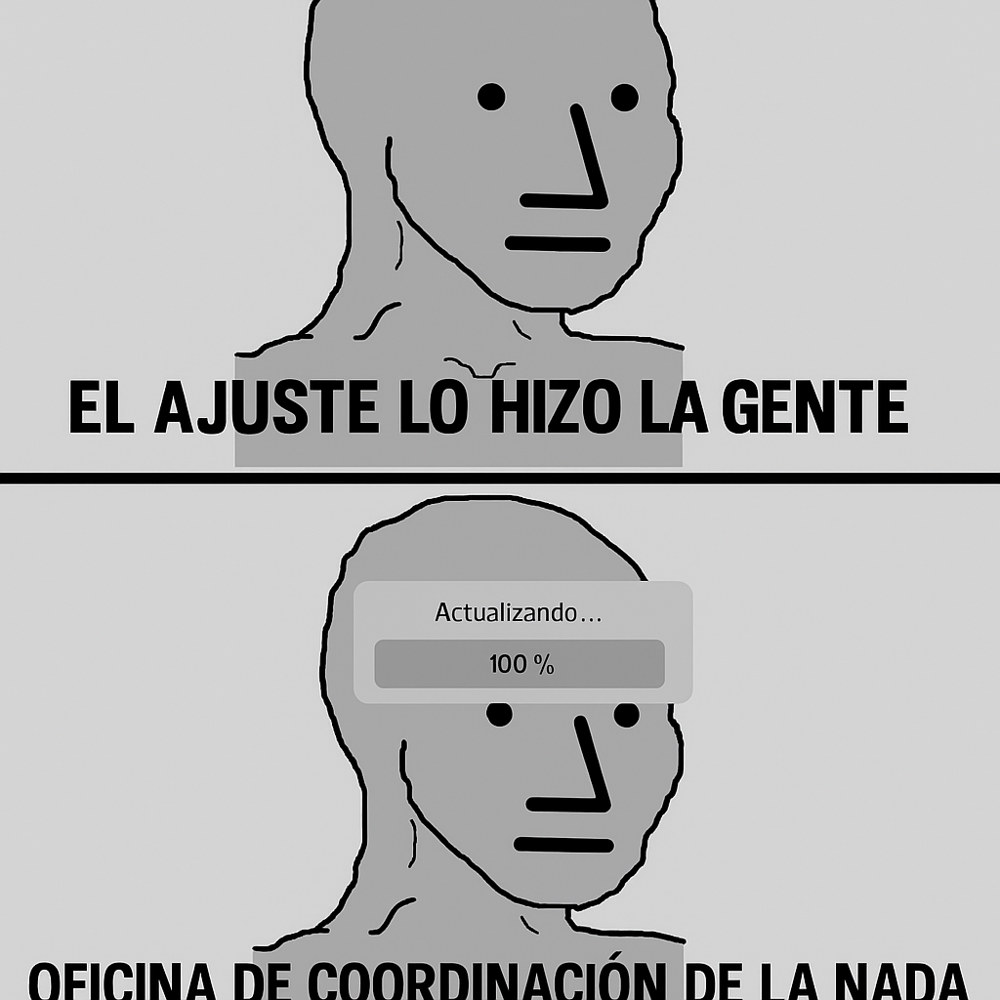

# Prompt Chaining: Chiste político ➝ Narración ➝ Meme visual

## 🎯 Objetivo
Diseñar una cadena de prompts que parte de un chiste político situado en la Argentina actual, lo transforma en una micro-narrativa y finalmente lo convierte en una idea visual de meme lista para generación por IA. Se trabaja con tres etapas encadenadas, cada una con su función clara, construyendo un flujo creativo completo.

## 🧠 Encadenamiento de prompts

🔹 **Paso 1: Generación de chiste**
```
Pensá un chiste político que se pueda entender en el contexto sociocultural actual de Argentina.
```

🔹 **Paso 2: Expansión narrativa**
```
Tomá la idea del chiste anterior y expandila a una narración breve de hasta 200 palabras. La narración debe conservar el tono irónico y el trasfondo político, pero sumar matices narrativos y un cierre inesperado.
```

🔹 **Paso 3: Generación de meme**
```
Sobre la base del texto creado en el paso anterior, generá un concepto de meme que siga alguna de las tendencias actuales de formato, estilo y tono. Describí cómo debería verse la imagen para ser luego generada por una IA.
```

📝 Instrucción adicional: Pensá paso a paso antes de responder.

---

## 💬 Resultado

### ✅ Chiste Político
> —Che, ¿viste que Milei ahora dice que el ajuste lo hizo la gente?  
> —Sí, y parece que en el próximo Presupuesto va a figurar "Milagros" como fuente de financiamiento.

---

### ✅ Narración Expandida
En una oficina pública desmantelada, un empleado jubilado observa su escritorio vacío con nostalgia. El cartel de "Dirección Nacional de Planificación Estratégica" cuelga torcido sobre una pared sin pintura. Entra un joven vestido de traje y con acento libertario.  

—Buenas, vengo a cerrar esto —dice, sacando una lapicera con el logo de una consultora.  

—¿Cerrar qué? Si ya no queda nadie —responde el viejo, sin levantarse.  

—Justamente. El Estado funciona mejor así. Lo hicimos entre todos —sonríe el joven, señalando un gráfico con caída libre del gasto público.  

—¿Y qué hacen con lo que ahorran?  

—¡Eso lo decide el mercado! —responde el joven, mientras se lleva la cafetera del lugar “porque el mérito también es saber aprovechar las oportunidades”.  

Afuera, un cartel nuevo reza: “Oficina de Coordinación de la Nada. Subsecretaría de Autoregulación Espontánea.”

---

### 🖼️ Meme generado
**Formato:** NPC Wojak + "Actualización de sistema"



**Texto superior:** EL AJUSTE LO HIZO LA GENTE  
**Texto inferior:** OFICINA DE COORDINACIÓN DE LA NADA

**Estilo visual:** fondo gris, diseño plano, tipografía sans-serif, estética minimalista propia de memes post-irónicos.

---

## 📌 Observaciones

- Este chaining permite integrar prompting **humorístico + narrativo + visual**.
- Muestra cómo una idea se **transforma progresivamente** en un producto multiformato.
- Ideal para crear contenidos editoriales, virales o de divulgación con base local y sensibilidad cultural.
- Puede adaptarse fácilmente para entrenamiento creativo, análisis político o branding irónico.

⚡ Ejemplo excelente de prompting encadenado con foco en producción cultural y visual desde texto.

---

**Licencia:** CC BY-NC-SA 4.0  
**Creado por:** Ernesto Gallegos  
**IA utilizada:** ChatGPT-4o + DALL·E
