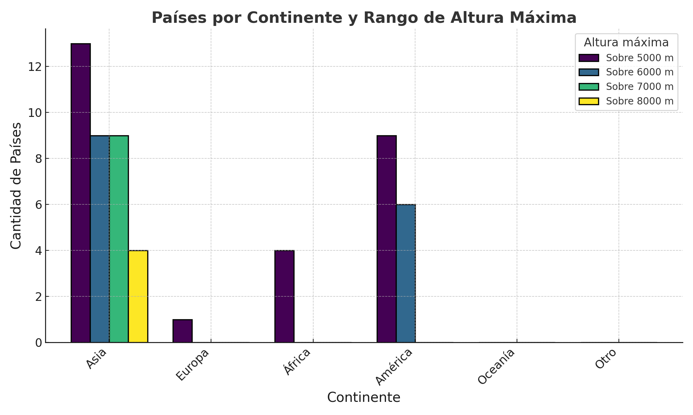
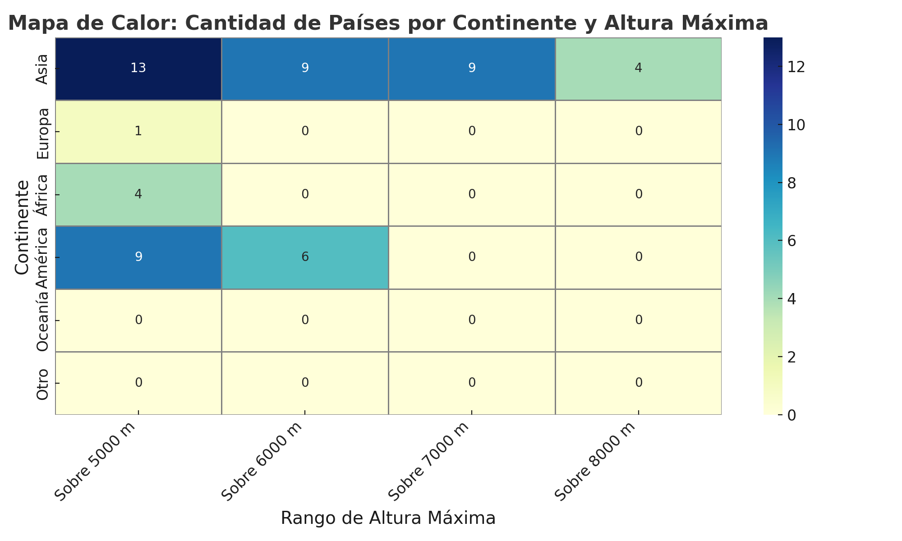

# Prompt: 🌍 Clasificación de Países por Altura Máxima sobre el Nivel del Mar
Este ejemplo muestra cómo combinar técnicas de `data wrangling`, visualización geográfica y razonamiento geoespacial para generar una clasificación estructurada de países según su punto más alto, y visualizar los resultados agrupados por umbrales de altura y continentes.

## 🎯 Objetivo
Diseñar un prompt que permita clasificar una lista de países según la altura máxima de su territorio, en función de umbrales establecidos (5000m, 6000m, 7000m, 8000m). El modelo debe asumir el rol de experto en geografía y ciencia de datos, justificar cada asignación con el nombre del pico más alto, y devolver los resultados en formato CSV.

## 🧾 Prompt utilizado

> Clasifica la siguiente lista de países en las siguientes categorías:
> 
> - Países con algún punto de su territorio por encima de los 5000 metros sobre el nivel del mar  
> - Países con algún punto de su territorio por encima de los 6000 metros sobre el nivel del mar  
> - Países con algún punto de su territorio por encima de los 7000 metros sobre el nivel del mar  
> - Países con algún punto de su territorio por encima de los 8000 metros sobre el nivel del mar  
> 
> Además  
> - Dar una justificación (ejemplo de su pico más importante)  
> - Expresar resultados en formato tabla (csv)

## 🔍 Lógica aplicada

1. Se compiló una tabla de los picos más altos por país utilizando fuentes confiables (CIA World Factbook, Wikipedia, etc.).
2. Se evaluó para cada país si superaba los umbrales definidos.
3. Se agruparon los resultados por continente.
4. Se generaron visualizaciones para facilitar la interpretación.

## 📊 Resultados

### 📁 Archivo CSV completo

[Descargar alturas_maximas_paises_8000.csv](./alturas_maximas_paises_8000.csv)

### 📌 Resumen por umbral

```json
{
  "Sobre_5000": [
    "Afganistán",
    "Argentina",
    "Birmania",
    "Bolivia",
    "Bután",
    "Canadá",
    "Chile",
    "China",
    "Colombia",
    "Ecuador",
    "Estados Unidos",
    "Georgia",
    "India",
    "Irán",
    "Kazajistán",
    "Kenia",
    "Kirguistán",
    "México",
    "Nepal",
    "Pakistán",
    "Perú",
    "República Democrática del Congo",
    "Rusia",
    "Tanzania",
    "Tayikistán",
    "Turquía",
    "Uganda"
  ],
  "Sobre_6000": [
    "Afganistán",
    "Argentina",
    "Bolivia",
    "Bután",
    "Chile",
    "China",
    "Ecuador",
    "Estados Unidos",
    "India",
    "Kazajistán",
    "Kirguistán",
    "Nepal",
    "Pakistán",
    "Perú",
    "Tayikistán"
  ],
  "Sobre_7000": [
    "Afganistán",
    "Bután",
    "China",
    "India",
    "Kazajistán",
    "Kirguistán",
    "Nepal",
    "Pakistán",
    "Tayikistán"
  ],
  "Sobre_8000": [
    "China",
    "India",
    "Nepal",
    "Pakistán"
  ]
}
```

### 🌎 Resumen por continente

```json
{
  "Asia": {
    "Sobre_5000": [
      "Afganistán",
      "Birmania",
      "Bután",
      "China",
      "Georgia",
      "India",
      "Irán",
      "Kazajistán",
      "Kirguistán",
      "Nepal",
      "Pakistán",
      "Tayikistán",
      "Turquía"
    ],
    "Sobre_6000": [
      "Afganistán",
      "Bután",
      "China",
      "India",
      "Kazajistán",
      "Kirguistán",
      "Nepal",
      "Pakistán",
      "Tayikistán"
    ],
    "Sobre_7000": [
      "Afganistán",
      "Bután",
      "China",
      "India",
      "Kazajistán",
      "Kirguistán",
      "Nepal",
      "Pakistán",
      "Tayikistán"
    ],
    "Sobre_8000": [
      "China",
      "India",
      "Nepal",
      "Pakistán"
    ]
  },
  "Europa": {
    "Sobre_5000": [
      "Rusia"
    ],
    "Sobre_6000": [],
    "Sobre_7000": [],
    "Sobre_8000": []
  },
  "África": {
    "Sobre_5000": [
      "Kenia",
      "República Democrática del Congo",
      "Tanzania",
      "Uganda"
    ],
    "Sobre_6000": [],
    "Sobre_7000": [],
    "Sobre_8000": []
  },
  "América": {
    "Sobre_5000": [
      "Argentina",
      "Bolivia",
      "Canadá",
      "Chile",
      "Colombia",
      "Ecuador",
      "Estados Unidos",
      "México",
      "Perú"
    ],
    "Sobre_6000": [
      "Argentina",
      "Bolivia",
      "Chile",
      "Ecuador",
      "Estados Unidos",
      "Perú"
    ],
    "Sobre_7000": [],
    "Sobre_8000": []
  },
  "Oceanía": {
    "Sobre_5000": [],
    "Sobre_6000": [],
    "Sobre_7000": [],
    "Sobre_8000": []
  },
  "Otro": {
    "Sobre_5000": [],
    "Sobre_6000": [],
    "Sobre_7000": [],
    "Sobre_8000": []
  }
}
```

## 📈 Visualizaciones

### Gráfico de barras por continente y altura máxima



### Mapa de calor (heatmap)



## 💡 Lecciones clave para prompt engineering

- **Descomposición progresiva del problema**: comenzar con un prompt amplio y estructurar respuestas iterativamente.
- **Enriquecimiento automático de datos**: integración de fuentes externas para completar los vacíos del input original.
- **Visualización como cierre de análisis**: sumar gráficos para traducir insights numéricos a formatos interpretables.

## 🛠️ Herramientas utilizadas

- `Python` + `pandas` para procesamiento de datos
- `matplotlib` y `seaborn` para visualizaciones
- `OpenAI GPT` para interpretación geográfica, estructuración de outputs y documentación

## 📌 Observaciones
- El prompt incluye **rol claro** (experto en geografía y ciencia de datos).
- La tarea está **especificada en términos de clasificación numérica**.
- La salida debe estar **estructurada como tabla CSV**, lo que permite su uso en contextos de análisis de datos.
- Este tipo de prompt puede integrarse a flujos de trabajo de consultoría, educación, visualización territorial o planificación climática.

⚠️ Nota: Este prompt requiere conocimiento geográfico preciso, por lo que es útil en tareas de clasificación automatizada combinada con verificación humana o APIs externas.

